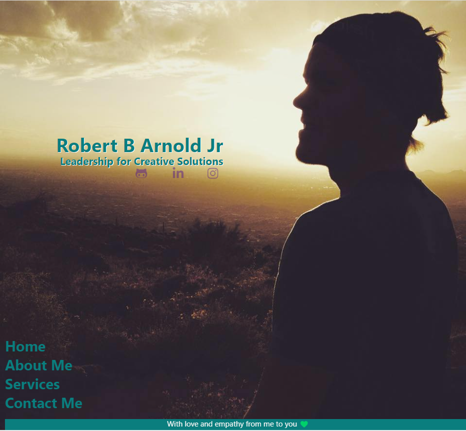

# My Professional Portfolio

## Table of Contents
- [Description](#description)
- [Link to Website](#website-link)
- [Github Repository](#github-repo)
- [Screenshot](#screenshot)
- [Liscense](#license)

#
#
### Description
#### This page serves as my professional profile to display my growth in full-stack web-development. It includes background info, links to projects I've worked on, and the ability to connect with me through social media or contact directly. It currently has only HTML structure and CSS styling but was designed with the intent to build on the simplicity of a minimalist style, using responsiveness to maintain aspect uniformity instead of growth and movement. Future goals are to change the button-stack into a hamburger menu with smooth scrolling and transitions. Projects tab will be used to showcase my growing skillbase in clickable cards. 

#

### Link to Website: [My Professional Portfolio Page](https://yogibruce.github.io/portfolio-page/)

### Github Repository: [portfolio-page](https://github.com/YogiBruce/portfolio-page)

#
### Screenshot

#
### License [MIT](http://choosealicense.com/licenses/mit/)